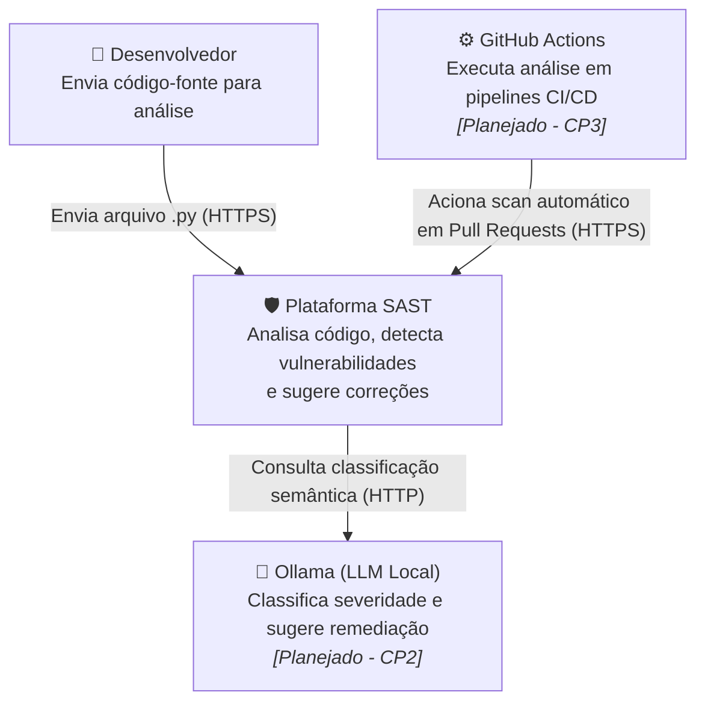
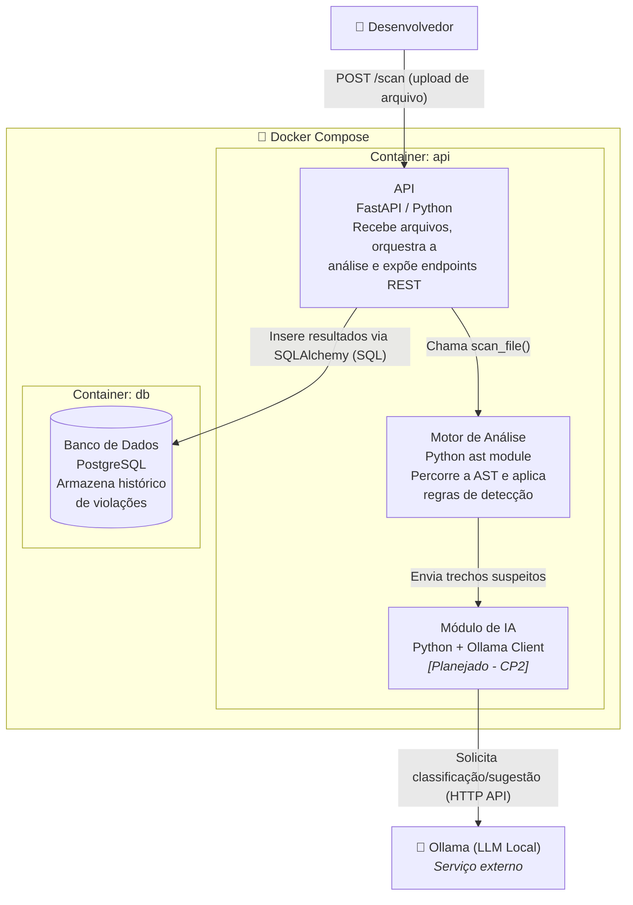

# Arquitetura da Plataforma SAST

Este documento descreve a arquitetura técnica da plataforma, seguindo o C4 Model em dois níveis: Contexto (visão externa) e Container (visão interna dos componentes). Os diagramas refletem o estado real da implementação até o CP1, com os componentes planejados para os próximos checkpoints sinalizados explicitamente.

## Nível 1 — Diagrama de Contexto

Mostra quem interage com o sistema e com quais serviços externos ele se conecta.

## Nível 2 — Diagrama de Container

Mostra os componentes internos da plataforma, como eles se comunicam, e como estão organizados em containers Docker.

**Nota sobre containerização**: os componentes `api` (API + Motor de Análise + Módulo de IA) e `db` (PostgreSQL) representados acima rodam em containers Docker isolados, orquestrados via `docker-compose.yml`. Cada container tem suas próprias dependências e ciclo de vida, comunicando-se através da rede interna do Docker Compose (os serviços se referenciam pelo nome, ex: `db`, não por `localhost`).

## Status de implementação

| Componente | Status |
|---|---|
| API (FastAPI) | ✅ Implementado (CP1) |
| Motor de Análise (AST) | ✅ Implementado (CP1) |
| Banco de Dados (PostgreSQL) | ✅ Implementado (CP1) |
| Containerização (Docker Compose) | ✅ Implementado (CP1) |
| Módulo de IA (Ollama) | 🔜 Planejado (CP2) |
| Integração CI/CD (GitHub Actions) | 🔜 Planejado (CP3) |

## Decisão de escopo: linguagem única (Python)

O motor de análise foi implementado com o módulo `ast` nativo do Python para a linguagem-alvo escolhida. A arquitetura foi desenhada de forma modular (parser desacoplado das regras) para permitir a futura substituição por Tree-sitter, viabilizando suporte a múltiplas linguagens sem reescrever o motor de regras.